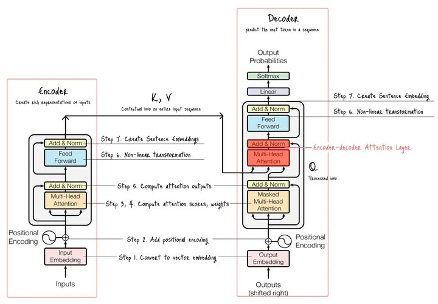
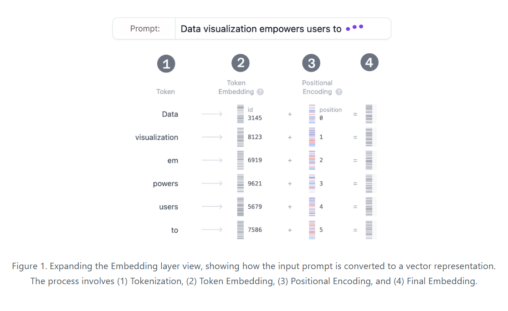
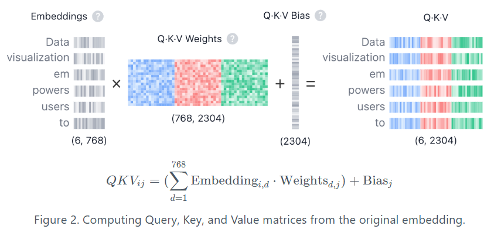
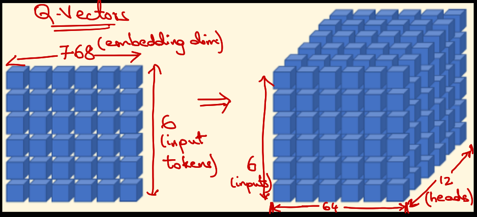
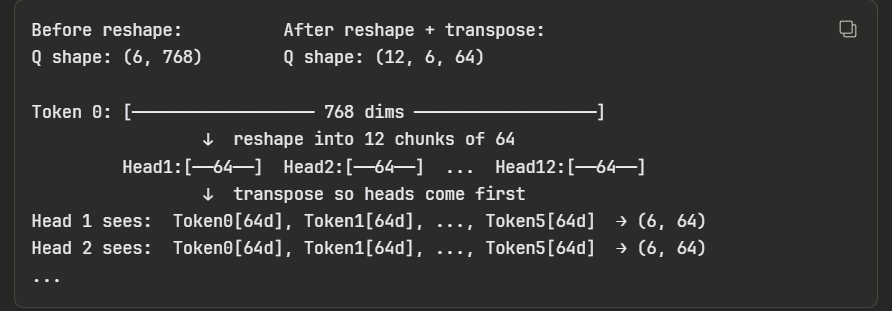
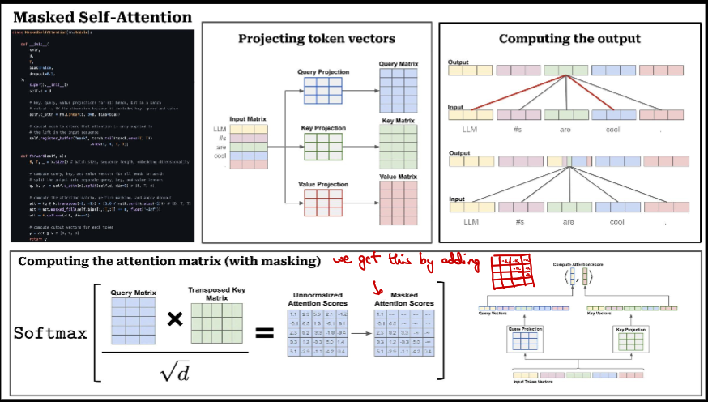
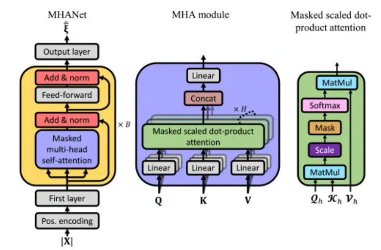
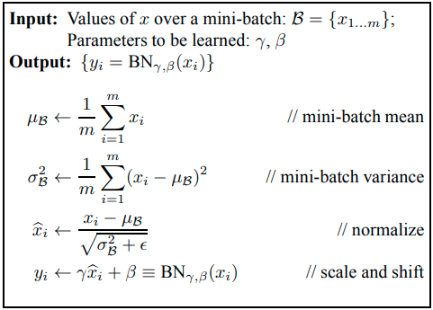
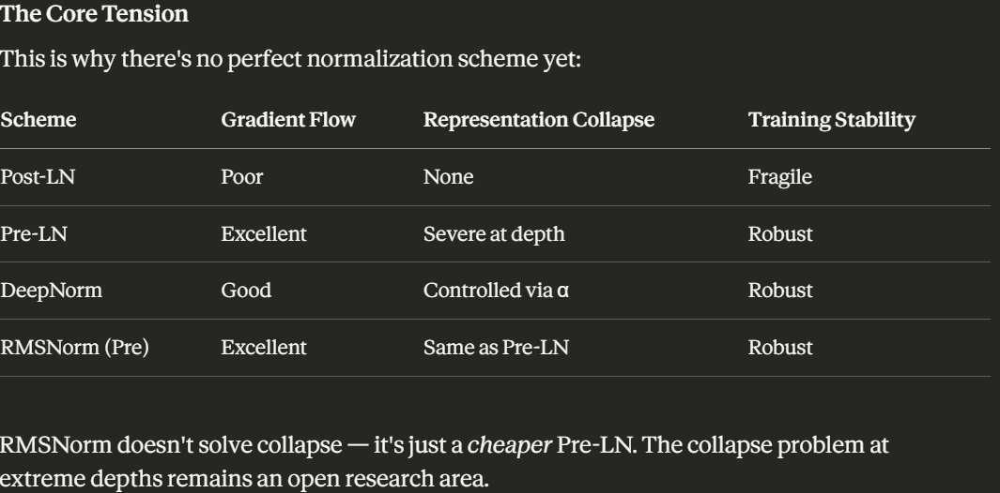

## What is a Transformer?
- Fundamentally, text-generative Transformer models operate on the principle of next-token prediction: given a text prompt from the user, what is the most probable next token (a word or part of a word) that will follow this input? 
- The core innovation and power of Transformers lie in their use of self-attention mechanism, which allows them to process entire sequences and capture long-range dependencies more effectively than previous architectures.


## Transformer Architecture Components
- Embedding
- Transformer Block
- Output Probabilities

### 1. Embedding
#### Process of transforming text into a numerical representation that the model can work with
** The output of this Embedding process is a Sentence matrix(also called input embeddings). The shape of this is (#INPUT_TOKENS, EMBEDDING_DIM)**

Process/Steps Involved:
1. Tokenization 
2. Token Embedding
3. Positional Encoding
4. Final Embedding

- Tokenization is the process of breaking down the input text into smaller, more manageable pieces called tokens. 

**The full vocabulary of tokens is decided before training the model: GPT-2's vocabulary has 50,257 unique tokens.**

- Each token in the vocabulary is represented as a 768-dimensional vector.GPT-2's entire vocabulary is stored in an Token Embedding Matrix(an embedding lookup table) of shape (50257, 768). Shape of Token Embedding Matrix is (VOCAB_SIZE, EMBEDDING_DIM).

**How it works:** When the model sees token ID 154, it goes to row 154 of this matrix and copies those numbers.



| Model | Architecture | Vocab Size | Embedding Dim ($d_{model}$) | Tokenizer Type | Unique Features |
| :--- | :--- | :--- | :--- | :--- | :--- |
| **BERT** (Base) | Encoder-only | 30,522 | 768 | WordPiece | Introduced Masked Language Modeling (MLM); separate `[CLS]` and `[SEP]` tokens. |
| **GPT-2** (Small) | Decoder-only | 50,257 | 768 | Byte-level BPE | Introduced the idea that "Language Models are Unsupervised Multitask Learners"; standard absolute positional embeddings. |
| **RoBERTa** | Encoder-only | 50,265 | 768 (Base)<br>1024 (Large) | Byte-level BPE | A robustly optimized BERT; removed Next Sentence Prediction (NSP); increased vocab size to match GPT-2 style. |
| **T5** (Base) | Encoder-Decoder | 32,128 | 768 | SentencePiece | Unified "Text-to-Text" framework; uses **Relative Positional Encodings** rather than absolute. |
| **GPT-3** (175B) | Decoder-only | 50,257 | 12,288 | Byte-level BPE | Massive scale up of GPT-2 architecture; uses Alternating Dense and Locally Banded Sparse Attention. |
| **LLaMA 1 & 2** (7B) | Decoder-only | 32,000 | 4,096 | SentencePiece (BPE) | Popularized **RoPE** (Rotary Positional Embeddings) and **SwiGLU** activation functions; Pre-normalization (RMSNorm). |
| **Mistral 7B** | Decoder-only | 32,000 | 4,096 | SentencePiece (BPE) | Uses **Sliding Window Attention** (SWA) and **Grouped-Query Attention** (GQA) for faster inference. |
| **LLaMA 3** (8B) | Decoder-only | **128,256** | 4,096 | Tiktoken (BPE) | Significant jump in vocab size compared to LLaMA 2; allows for much better data compression (fewer tokens per sentence). |
| **Gemma** (7B) | Decoder-only | **256,000** | 3,072 | SentencePiece (Proto) | Massive vocabulary size; GeGLU activations; normalizes input embeddings by $\sqrt{d_{model}}$. |
| **GPT-4** | Decoder-only (MoE) | ~100,277* | Unknown | Tiktoken (`cl100k`) | *Estimated based on OpenAI's `cl100k_base` tokenizer.* Likely a Mixture of Experts (MoE) architecture. |

---

**Old Models used vocab size of 30-50k while modern,newer models use 128k+ vocab size.**
- **Larger Vocab = Higher Information Density. A single token can represent a whole complex word. This effectively increases the context window because the same sentence requires fewer tokens.(i.e Larger Vocab = fewer tokens per sentence)**
- **Tradeoff is large memory and final output layer (Logits) becomes massive, requiring significant compute to calculate probabilities over 128k or 256k possibilities.(transformer predicts the next token based on current input tokens, so basically like too many classes present to choose the next token from)**

- In GPT-2 (and many other transformers), the Token Embedding Matrix is often "tied" to the output layer. This means the matrix used to turn inputs into vectors is the exact same matrix used at the very end to turn the final hidden states back into probabilities for the next word. This is known as **Weight Tying**.

Related Research: 
1. [Scaling Laws with Vocabulary: Larger Models Deserve Larger Vocabularies](https://arxiv.org/abs/2407.13623)
2. [Large Vocabulary Size Improves Large Language Models](https://aclanthology.org/2025.findings-acl.57.pdf)

### 2. Transformer Block
#### Transformer Block consists of multi-head self-attention and a Multi-Layer Perceptron layer. 
- Most models use multiple such blocks that are stacked sequentially one after the other and the token representations evolve through layers, from the first block to the last one
Eg: The GPT-2 (small) model consists of 12 such blocks.

#### A) Multi-Head Self-Attention (MHSA)
- The **Self-Attention mechanism** enables the model to capture relationships among tokens in a sequence, so that each token’s representation is influenced by the others.
- **Multiple attention heads** allow the model to consider these relationships from **different perspectives**; for example, one head may capture short-range syntactic links while another tracks broader semantic context.

Process/Steps Involved:
1. Query, Key, and Value Matrices
2. Multi-Head Splitting
3. Masked Self-Attention
4. Output and Concatenation

##### 1. Query, Key, and Value Matrices
* Each token embedding vector is transformed into 3 dimensions(3 basis vectors): Query (Q), Key (K), and Value (V). These vectors are derived by multiplying the input embedding matrix with learned weight matrices for Q, K, and V.

**The choice of 3 vectors is based on Information Retrieval Theory and the necessity of Asymmetric Relationships in language.**

---

##### A) Language is Assymetric:
If we did not transform the input X and instead just used the input vector X for everything, the attention score would be: X.X<sup>T</sup>

For a phrase "river bank", bank is dependent on river to determine if it is related to nature or is a financial institution but river is not dependent on bank. So, when the token for bank is to be predicted by the model, it needs context from "river" token and not viceversa. This is the Asymmetric Relationship in Languages. Using a single dimension defeats this purpose as dot product of 
matrices/vectors is symmetric. 

##### B) Information Retrieval Theory:
Imagine you are looking for a book in a library database. The process involves three distinct components:

- Query (Q): What you type into the search bar (e.g., "books about space").
- Key (K): The metadata/labels on the books in the database (e.g., "Astronomy", "Sci-Fi", "Cosmology").
- Value (V): The actual content of the book you pull off the shelf.

We need atleast 3 dimensions(including the input) to retrieve the information we need.

---
##### Why not higher dimensions?
We can have more than 3 dimensions for retrieving the info(in transformers case, it is relevant tokens) but it is redundant as having more dimensions is not enriching the information(i.e rank of the matrix is not increasing)

Explanation:

If your input embedding x has a dimension of 768, it contains a finite amount of information. Geometrically, the data points sit in a 768-dimensional subspace.
If you project this 768 vector into a 10,000-dimensional space using a matrix multiplication (768×10000), the resulting vector is technically 10,000 numbers long, but it still only has a mathematical rank of 768.

**Rank of Matrix:** The rank of a matrix is the maximum number of linearly independent row or column vectors, representing the dimension of its vector space.
i.e How many dimensions/numbers in the matrix actually matter or contribute to the information it represents.

K,Q,V Matrices:
If we have a vector denoting force of say 5N, we can transform it into x,y,z components as these are the basis vectors for the Cartesian coordinate system. Similarly for an embedding vector with 768 dimension, we need to multiply it with 768 scalars to project them into K,Q,V dimensions. But since these dimensions are not standard/fixed like our Cartesian coordinate system, we learn them using 3 matrices instead.

##### 2. Multi-Head Splitting
Once Q,K,V matrices are computed(after multiplying input embedding matrix with Q,K,V weight matrices), they are split into multiple heads by reshaping the embedding dimension into (num_heads, head_dim).

i.e (seq_len, embed_dim) -> (seq_len, num_heads, head_dim) or (batch_size, seq_len, embed_dim) -> (batch_size, seq_len, num_heads, head_dim)

In case of GPT-2 model, embed_dim is 768 and num_heads is 12. So, head_dim is 768/12 = 64.
(6,768) -> (6,12,64)



**Once each of Q,K,V vectors are transformed, we perform a transform to bring the head dimension to the first dimension. i.e (seq_len, num_heads, head_dim) -> (num_heads, seq_len, head_dim)**



##### 3. Multi Head Attention
- Multi-Head Self-Attention (MHSA) is the core operation in the Transformer architecture.
- Transformer uses multiple heads to capture different relationships among tokens in a sequence.
- The part that multiplies Q projection with K<sup>T</sup> and scale it down using the square root of the dimension of the key vectors is called **Self-Attention**.(Math formula is Scaled Dot-Product Attention, SDPA)
- In transformer encoder part, each head computes this Self-Attention and while in decoder part, it computes this Self-Attention with a mask, thus it is called **Masked Self-Attention**.

- After multiplying Q and K projections, followed by dividing by square root of dimension of key vectors, we apply a mask(adding an upper triangular matrix of -infinity) before computing the softmax.
- If we dont apply the mask, the model will have access to future tokens while predicting the current token, thus it learns one-to-one mapping(just copying the next token as the current token, i.e identity fn.), not the exact language modeling.
- Since the activation is softmax(e^x / sum(e^x)), using -infinity in the upper triangular matrix ensures that the softmax output for those positions is 0.(i.e the attention scores is 0 for future tokens)



##### 4. Add & Norm
-  "Add & Norm" layer consists of two distinct operations applied sequentially:
    A) "Add" (Residual Connection):
        - This is a skip connection that adds the original input of a sub-layer to its output.
        i.e Output=x+Sublayer(x)

        - **The rule of thumb is: Any complex mathematical transformation that the model applies to the data, which is then bypassed by a residual (skip) connection, is considered a "sub-layer."**
        - In the context of vanilla transformer, MHSA and FFN are sublayers.

    B) "Norm" (Layer Normalization):
        - Layer Normalization normalizes the values across the features (hidden dimensions) for each token independently.
        - **It stabilizes the training process by ensuring the inputs to the next layer have a consistent mean (0) and variance (1). This smooths the optimization landscape and prevents activations from exploding or collapsing.**
        - Apart from normalising values, LayerNorm also has gamma, beta learnable parameters(scaling and shifting, [look here](code/related_notes/pytorch-useful-notes.md)). Without these parameters, you'd be forcing every layer's input into the same distribution, destroying expressive power.



    WHY NOT BATCH NORM?
    - Seq2seq models cant have fixed batch size and adding padding or truncating the tokens for uniform size messesup the quality of the inputs to the next layer. 
  
  ###### Variants of Add&Norm
    1) Post-LN (The Original Design):
        - Original Design introduced in paper "Attention is All You Need" (Vaswani et al., 2017), used in early BERT models
        - Architecture: LayerNorm(x + Sublayer(x))
        - **Normalisation applied after the residual addition**
        - The Problem: The gradients near the output layer are well-behaved, but as they flow backward through multiple Post-LN layers, they degrade. To prevent early training divergence, Post-LN requires a strict Learning Rate Warmup (starting with a near-zero learning rate and slowly increasing it). Without warmup, deep Post-LN models simply fail to train.
        - This architecture is harder to train due to vanishing gradient problem but if trained correctly, has a higher theoritical capacity as we ensure that the outputs after each layer(coming directly out of LayerNorm) are of comparable magnitude, so problem of "Representation Collapse" never happens. i.e better Representation Quality.


    2) Pre-LN (The Modern Standardizer)
        - Architecture: x + Sublayer(LayerNorm(x))
        - **Normalisation applied before the residual addition**. Sublayer input is normalised before applying nonlinear transformation(sublayer) and this is added to residual connection.
        - Benefit: Because the residual connection is completely free of any transformations, gradients can flow from the very top of the network to the bottom flawlessly. i.e we avoid Vanishing Gradient problem but we introduce Representation Collapse Problem. Both are issues for deep networks
        - The training with PreLN is very stable from the first training step and so doesnt need learning warmup(or a very mild one), practical for deep models at scale.
        - Trade-off: Xiong et al. noted that while Pre-LN is easier to train, Post-LN actually has a slightly higher theoretical capacity and better performance if you can get it to converge. Still, Pre-LN became the de-facto standard for almost all large language models (GPT-3, BERT variations, etc.).
        - The main disadvantage of this is Representation Collapse Problem. This effect is a gradual degradation,barely noticable at ~12-24 layers(thus GPT-2/GPT-3 didn't suffer badly), but at 100+ layers,this is so severe that it motivated DeepNorm.
  
    3) RMSNorm (The Efficiency Upgrade)
        - Current State of the Art, used in models like LLaMA (1, 2 & 3), Mistral, Chinchilla, and Gemma.
        - Introduced in "Root Mean Square Layer Normalization" (Zhang & Sennrich, 2019)
        - Architecture: Replaces standard LayerNorm with RMSNorm in the Pre-LN setup.
        - How it works: The authors realized that the "mean-centering" operation in LayerNorm (subtracting μ) is computationally expensive and doesn't actually contribute much to the success of the Transformer. RMSNorm drops the mean-centering and only scales the variance
        - Benefit: It reduces computational overhead by 7% to 64% while maintaining identical accuracy and stability.

    4) DeepNorm (Fixing Post-LN for Extreme Depth)
        - Introduced in "DeepNet: Scaling Transformers to 1,000 Layers" (Wang et al., Microsoft, 2022)
        - Architecture: LayerNorm(α⋅x + Sublayer(x))
        - How it works: Microsoft researchers wanted to reclaim the superior performance of Post-LN but fix its instability. They introduced DeepNorm, which scales the residual connection by a constant α (greater than 1) and scales down the initialization of the neural network weights.
        - Benefit: This simple mathematical trick bounded the gradient updates safely, allowing them to train a 1,000-layer Transformer without divergence—something Pre-LN struggles with due to representation collapse at extreme depths.
    
    5) Getting Rid of Norm entirely? (ReZero / SkiP-Init)
        - Used in papers like "ReZero is All You Need" (Bachlechner et al., 2020); "SkiP-Init" (Dehghani et al., 2020)
        - Architecture: x + α⋅Sublayer(x)
        - How it works: Instead of applying complex Layer Normalization, these papers introduced a single learnable scalar parameter (α) for each layer, initialized to exactly 0.
        - The Benefit: At the start of training, the network acts as a literal identity function (outputting exactly what was input). As training progresses, the network slowly learns to incorporate the Attention and FFN layers by increasing α. This trains incredibly fast and requires no normalization layer at all, though it hasn't widely replaced RMSNorm in massive commercial LLMs due to mixed scaling results.

    6) ResiDual:
        - Introduced in "ResiDual: Transformer with Dual Residual Connections" (Xie et al., 2023)
        - Seesaw Effect: Pre-Norm and Post-Norm each make distinct trade-offs between vanishing gradient and representation collapse(anologous to 2 ends of a seesaw), fixing one reintroduces another. The rootcause for this issue is fixed coupling of residual stream and sublayer output. ResiDual, SandwichNorm, DeepNorm,HyperConnections are some innovations to fix this issue.
        - Instead of choosing between PreLN and PostLN, run both residual streams simultaneously and merge them
        - Each token is represented by 2 streams(vectors) at each layer: POST Stream maintains a normalised, well behaved representation(preventing representation collapse) while PRE Stream provides a clean gradient highway(preventing vanishing gradient). Two streams interact and inform each other.
        - Cons: Higher memory and compute due to 2 residual streams, implementation complexity and coupling between 2 streams needs careful tuning(hyperparameter sensitivity) 


    7) Sandwich Norm:
    8) Hyper-Connections


---

**Representation Collapse Problem**: 
    - Residual Stream: In a transformer, every token is represented by a vector that flows through all L layers.This vector is called Residual Stream.
    - In a transformer, think of the residual stream as a running "memory vector" that persists across all layers. At each layer, the sublayer (attention or FFN) computes a small update and adds it to this stream.
    - At initialization, sublayer outputs are small (weights are initialized near zero). So the update at each layer is tiny relative to x_in. That's fine and even desirable early in training.
    - The problem develops as depth increases. Trace what happens to the magnitude of the residual stream across layers:
```
            x_0  → initial embedding, magnitude ≈ 1
            x_1  = x_0 + small_update  →  magnitude slightly > 1
            x_2  = x_1 + small_update  →  magnitude slightly > x_1
            ...
            x_L  = enormous magnitude after L layers
```
- **The residual stream monotonically grows because you are only ever adding to it, never normalizing it.**
         
         - PreLN style LayerNorm, normalised only the sublayer part but x itself is raw and unnormalised. 
 - **i.e at deep layers, the sublayer's contribution becomes vanishingly small relative to the residual. So, the depth becomes decorative(x_out = x_in+tiny_sublayer_part ≈ x_in)** 


  


## MHSA Shape Transformations
> Reference: GPT-2 Small — `seq_len=6`, `embed_dim=768`, `num_heads=12`, `head_dim=64`, `vocab_size=50257`

---

## Pre-Block (runs once)

| Step | Operation | Input Shape | Output Shape | Description |
| :---: | :--- | :---: | :---: | :--- |
| 1 | Token + Positional Embedding | `(6,)` | `(6, 768)` | Each token ID is looked up in the embedding table and summed with its positional encoding |

---

## Transformer Block × N (repeats 12× in GPT-2 parallelly)

### A) Multi-Head Self-Attention (MHSA)

| Step | Operation | Input Shape | Output Shape | Description |
| :---: | :--- | :---: | :---: | :--- |
| 2 | QKV Projection | `(6, 768)` | `(6, 2304)` | Input matrix is multiplied by the QKV weight matrices W_Q, W_K, W_V [each of shape **(embed_dim, embed_dim)** ] to produce all three projections at once |
| 3 | Split Q, K, V | `(6, 2304)` | `3 × (6, 768)` | The 2304-dim output is sliced into three separate Q, K, V matrices each of 768 dims |
| 4 | Reshape into heads | `(6, 768)` | `(6, 12, 64)` | Each of Q, K, V is reshaped — the 768 embedding dim is split into 12 heads of 64 dims each |
| 5 | Transpose | `(6, 12, 64)` | `(12, 6, 64)` | Head dimension is moved to front so each head operates independently on all 6 tokens |
| 6 | Scores — Q × Kᵀ | `(12, 6, 64) × (12, 64, 6)` | `(12, 6, 6)` | Every token's query is dot-producted against every token's key to produce one relevance score per pair |
| 7 | Scale | `(12, 6, 6)` | `(12, 6, 6)` | Each score is divided by √64 = 8 to **prevent vanishing gradients** from large dot products |
| 8 | Mask *(decoder only)* | `(12, 6, 6)` | `(12, 6, 6)` | Future token positions are filled with −∞ so they become zero after softmax **(add a matrix of same shape with upper triangle as -inf)** |
| 9 | Softmax | `(12, 6, 6)` | `(12, 6, 6)` | Each row of scores is converted to a probability distribution summing to 1 |
| 10 | Weighted sum — AttnWeights × V | `(12, 6, 6) × (12, 6, 64)` | `(12, 6, 64)` | Each token's output is a weighted blend of all Value vectors according to the attention weights |
| 11 | Transpose back | `(12, 6, 64)` | `(6, 12, 64)` | Head dimension is moved back after position so heads can be concatenated along the embedding axis |
| 12 | Reshape — concatenate heads | `(6, 12, 64)` | `(6, 768)` | All 12 heads are concatenated back into a single 768-dim vector per token |
| 13 | Output projection W_O | `(6, 768)` | `(6, 768)` | Learned linear layer re-mixes information across all heads into the final attention output |
| 14 | Residual + LayerNorm | `(6, 768)` | `(6, 768)` | Original input is added back to the attention output and normalised for training stability |

> **Steps 4–5 and 11–12** are free memory reshapes — no computation, no learned parameters.
> **Steps 6–13** are the core MHSA computation.

---

### B) Feed-Forward Network (FFN)

| Step | Operation | Input Shape | Output Shape | Description |
| :---: | :--- | :---: | :---: | :--- |
| 15 | FFN up-projection (W_1) | `(6, 768)` | `(6, 3072)` | Each token is independently projected up to 4× the embedding dim |
| 16 | Activation (GELU) | `(6, 3072)` | `(6, 3072)` | Non-linearity applied element-wise, enabling the network to learn non-linear relationships |
| 17 | FFN down-projection (W_2) | `(6, 3072)` | `(6, 768)` | Each token is projected back down to embedding dim |
| 18 | Residual + LayerNorm | `(6, 768)` | `(6, 768)` | FFN input is added back and normalised — completes one full Transformer block |

---

## Post-Block (runs once)

| Step | Operation | Input Shape | Output Shape | Description |
| :---: | :--- | :---: | :---: | :--- |
| 19 | Final linear (W_vocab) | `(6, 768)` | `(6, 50257)` | Last token's hidden state is projected to vocabulary size to produce raw logit scores |
| 20 | Softmax | `(6, 50257)` | `(6, 50257)` | Logits are converted to probabilities — the model samples the next token from this distribution |

---

## Summary

| Phase | Steps | Repeats |
| :--- | :---: | :--- |
| Embedding | 1 | Once |
| Transformer Block (MHSA + FFN) | 2–18 | 12× in GPT-2 |
| Output Projection | 19–20 | Once |

Sources:
- https://krypticmouse.hashnode.dev/attention-is-all-you-need
- https://cameronrwolfe.substack.com/p/decoder-only-transformers-the-workhorse
- https://poloclub.github.io/transformer-explainer/
- https://www.projectpro.io/article/multi-head-attention-in-transformers/1166
- https://www.vizuaranewsletter.com/p/why-do-we-need-masking-in-attention
- https://towardsdatascience.com/how-to-estimate-the-number-of-parameters-in-transformer-models-ca0f57d8dff0/
- https://molgorithm.medium.com/what-is-add-norm-as-soon-as-possible-178fc0836381
- https://github.com/hkproj/pytorch-transformer/tree/main
- https://www.youtube.com/watch?v=RsuSOylfN2I


- On Layer Normalization in the Transformer Architecture (PreLN paper)
- Understanding the Difficulty of Training Transformers
- ResiDual: Transformer with Dual Residual Connections
- Hyper-Connections
- Scaling Language Models: Methods, Analysis & Insights from Training Gopher
- NormFormer: Improved Transformer Pretraining with Extra Normalization
- Transformers without Tears: Improving the Normalization of Self-Attention
- Exploring the Impact of Layer Normalization for Zero-shot Neural Machine Translation
- Pre-RMSNorm and Pre-CRMSNorm Transformers: Equivalent and Efficient Pre-LN Transformers