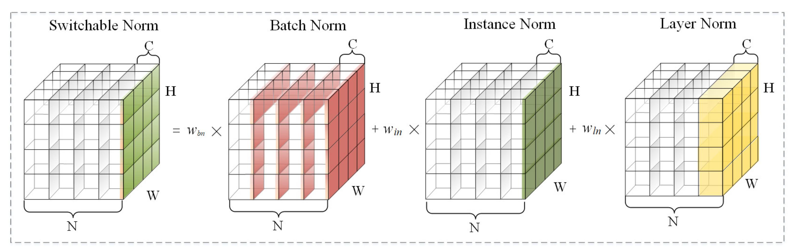
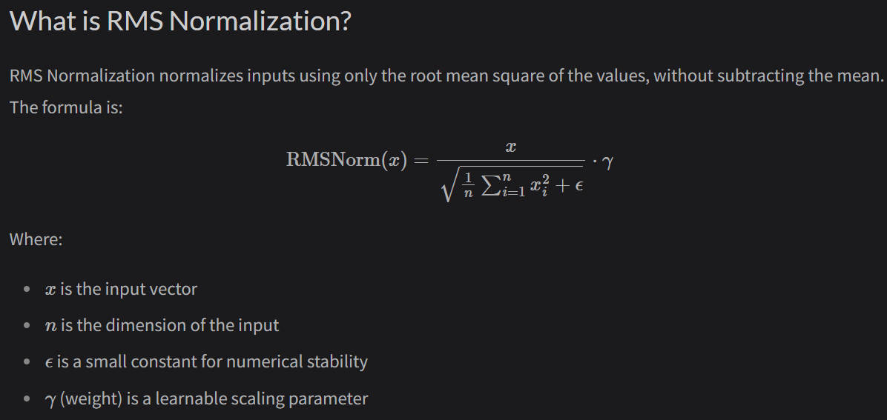

# Normalisation and its varieties

Normalisation methods can be defined into 3 categories:

1. Activation Norms (Normalizing the data itself across different dimensions).
2. Weight Norms (Normalizing the neural network's parameters).
3. Transformer-Specific Architectural Norms (Tweaking where and how norms are applied inside attention mechanisms).

Category 1: Activation Norm Family

These techniques look at the data flowing through the network (a tensor usually shaped as [Batch, Channels/Features, Spatial Dimension]) and compute the mean and variance across different axes.

* 1.1 Batch Normalization (BatchNorm)
* 1.2 Layer Normalization (LayerNorm)
* 1.3 Instance Normalization (InstanceNorm)
* 1.4 Group Normalization (GroupNorm)
* 1.5 Switchable Normalization (SwitchableNorm)
* 1.6 Root Mean Square Normalization (RMSNorm)
* 1.7 Dynamic Group Normalization (DGN)
* 1.8 Synchronized Batch Normalization (SyncBN)
* 1.9 Split Batch Normalization (Split-BN)
* 1.10 Local Response Normalization (LRN)

Category 2: Weight Norm Family

These techniques normalize the neural network's internal parameters/weights rather than the data.

* 2.1 Weight Normalization (WeightNorm)
* 2.2 Spectral Normalization (SpectralNorm,SN)

Category 3: Transformer-Specific Architectural Norms

Highly specific normalization placements to keep massive transformer models from collapsing.

* 3.1 QK Normalization (QK Norm)
* 3.2 Sandwich Normalization (Sandwich Norm)
* 3.3 DeepNorm

#### 1.1 Batch Norm:
    - Introduced in 2015 (Ioffe & Szegedy), this is the "grandfather" of modern normalization.
    - Normalizes a single feature across the entire batch of data.
    - Architecture / Formula: μ and σ are calculated across the Batch dimension for each specific channel/feature.
    - Purpose: Heavily smoothens the optimization landscape and allows for massive learning rates in Computer Vision.
    - Cons: Not used in transformers which have variable input token lengths(some sentences can be 10 tokens in length while another can only be 4 tokens). Truncating these inputs using fixed batch sizes or padding with zeroes makes BatchNorm highly unstable. LayerNorms are invented to solve this issue.

#### 1.2 Layer Norm:
    - Introduced in paper "Attention is All You Need" (Vaswani et al., 2017)
    - Normalizes the values across the features (hidden dimensions) for each token(sample) independently.
    - Purpose: Used in transformer architectures to normalise each input token.(agnostic to input length)

#### 1.3 Instance Norm:
    - Introduced by Ulyanov et al. (2016).
    - Normalizes one single channel, for one single sample, across its spatial dimensions. There is zero mixing between batches or between features.
    - BatchNorm looks at the whole batch, LayerNorm looks at all features of one sample, InstanceNorm looks at each channel in each sample individually.
    - Purpose: In images, the "mean" and "variance" of a channel often encode the style or contrast of the image (e.g., is it day or night?). Normalizing this removes the style but keeps the content.
    - Usage: Heavily used in Style Transfer networks (like CycleGAN) and Audio Generation, where you want the network to focus on structural content rather than overall amplitude or contrast.

#### 1.4 Group Norm:
    - Introduced by Wu & He (2018) as a bridge between LayerNorm and InstanceNorm.
    - It takes the channels/features of a single sample, divides them into discrete "groups" (e.g., 32 groups), and calculates μ and σ within each group.
      - If Group size = 1, it becomes LayerNorm. If Group size = Total Channels, it becomes InstanceNorm.
    - Purpose: BatchNorm fails when your batch size is very small (e.g., batch size of 1 or 2). GroupNorm performs identically well regardless of the batch size because it operates independently on each sample.
    - Usage: Extremely popular in CV tasks that need massive memory, limiting batch sizes to 1 or 2.Used in Diffusion models and Mask R-CNN.

#### 1.5 Switchable Norm:
    - Introduced by Luo et al. (2018). Instead of forcing the AI engineer to guess which norm is best (Batch, Layer, or Instance), why not let the neural network choose?
    - Architecture: Weighted sum of BatchNorm, LayerNorm and InstanceNorm. 
    - Purpose: Makes architectures incredibly robust across different tasks and batch sizes.
    - Cons: Rarely used in production LLMs because computing three different norms simultaneously introduces a massive computational overhead.

#### 1.6 RMSNorm:
    - Introduced in "Root Mean Square Layer Normalization" (Zhang & Sennrich, 2019)
    - "mean-centering" operation in LayerNorm (subtracting μ) is found useless in transformers, so only variance is scaled
    - Purpose: It reduces computational overhead by 7% to 64% while maintaining identical accuracy and stability. 

#### 1.7 DGN Norm:
    - Introduced in "Dynamic Group Normalization: Spatio-Temporal Adaptation to Evolving Data Statistics" (Smadar & Hoogi, CVPR 2025)
    - Standard GroupNorm forces channels into a fixed number of groups (e.g., 32 groups) sequentially. However, the authors noted that rigidly grouping channels forces channels with completely different statistical properties to be normalized together, which dilutes their unique features.
    - DGN turns the "grouping" process into a learnable, adaptive mechanism. Instead of static groups, an efficient spatio-temporal mechanism continuously evaluates how similar different channels are mathematically, redistributes channels into optimized groups based on their actual statistical coherence, while maintaining their physical tensor positions using reference indices.
    - Purpose: DNN struggle with "out-of-distribution" data or long-tailed (imbalanced) datasets. By letting the network group channels dynamically, it preserves the distinctiveness of minority-class features.

#### 1.8 SyncBN:
    - SyncBatchNorm forces all "n" GPUs to pause during the forward pass, communicate over the network, and calculate the global mean and variance for all y images(y = #GPUs * batch_size)
    - Used in PyTorch's Distributed Data Parallel (DDP).

#### 1.9 Split-BN:
    - Introduced in "Split Batch Normalization: Improving Semi-Supervised Learning under Domain Shift" (Zając et al., 2019) and popularised in "Adversarial Examples Improve Image Recognition" (Xie et al., 2019)
    - Also referred to as Auxiliary BatchNorm or Domain-Specific BatchNorm (DSBN)
    - Standard Batch Normalization calculates the mean (μ) and variance (σ) across all images in a batch. But what if your batch contains two sets of data with completely different statistical distributions?
    - Split-BN solves this by physically splitting the batch and routing it through parallel, separate Batch Normalization layers
    - Crucially, the neural network's actual weights (Convolutional or Linear layers) are 100% shared across all data. Often, even the learned scaling parameters (γ and β) are shared. Only the tracking of the mean and variance is split
    - Usage: Heavy Data Augmentation(synthetic data), Domain Adaptation / Semi-Supervised Learning use cases where we try to adapt synthetic data(source) to realworld data(target)

#### 1.10 LocalResponseNorm:
    - Introduced in AlexNet paper(2012)
    - LRN looks at a single spatial pixel (e.g., the pixel at row 5, column 5). It takes the activation at that pixel and normalizes it by dividing it by the sum of the squared activations of the same pixel in the neighboring channels.
    - Obsolete, VGG paper(2014) proved it increases computation with no performance boost.
  

Resources:
- https://theaisummer.com/normalization/
- https://www.kapilsharma.dev/posts/triton-kernels-rms-norm/
