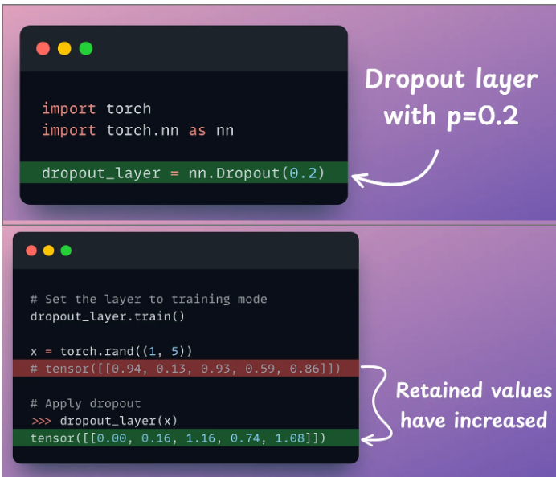

# Pytorch Useful Notes

#### This file contains useful notes about pytorch applications used in the sourcecode, its a reference for important pytorch jargon to build new architectures from scratch better.
---

### 1) nn.Parameter():
    - Subclass of torch.Tensor used to define a trainable parameter within a neural network model.
    - By default, any tensor wrapped in nn.Parameter has its requires_grad attribute set to True. 
    - Regular torch.Tensor attributes (even with requires_grad=True) are not automatically added to the module's parameter list and are not updated by the optimizer.
    - In layerNorm, we have gamma and beta as learnable parameters(multiplicative and additive parameters). These are coded using "nn.Parameter()"
    - **These gamma,beta parameters are critical — without it, you'd be forcing every layer's input into the same distribution, destroying expressive power.**

### 2) torch.mean(input, dim, keepdim=False, *, dtype=None, out=None):
    - Returns the mean of elements of the input tensor.
    - If dim is a tuple of ints, the mean is computed over all the dimensions specified in the tuple.
    - If keepdim is True, the dimensions which are reduced are left in the result as dimensions with size one.
    
### 3)torch.Dropout(p, inplace)
    - During **training**, randomly zeroes some of the elements of the input tensor with probability p based on Bernoulli distribution.
    - The elements that are non-zeroed are scaled by by a factor of 1/(1-p). 
    - In evaluation or testing phase, dropout is not employed by setting p=0.
    - The main problem solved by this practice is **Co-adaptation**, i.e prevent decision making based on a few dimensions of the vector instead of looking at the complete vector.
    - Scaling remaining value(Inverted Dropout trick) is needed because the sum of the remaining neurons would be less if we drop some elements, so we scale the rest so that this entire vector doesnt have a very small value when addedup and the gradient doesnt just vanish.
    - Since we train the data for multiple epochs and the dropout acts on different elements of the vector, as we have decent amount of epochs, the model will eventually know each input correctly and the input vector is not corrupted(by dropping a few dimensions in its vector) 
